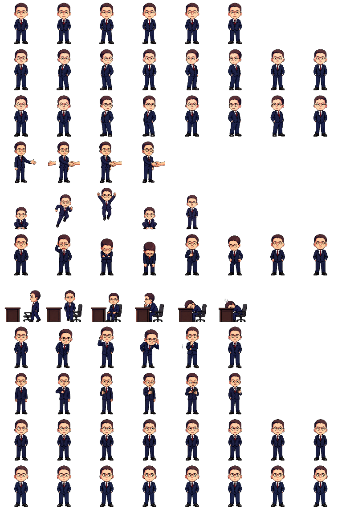

# Suit Pet for Codex Desktop

一款西装造型的 Codex Desktop 自定义像素宠物，包含待机、转身、握手、跳跃、复盘、看手机、伏案休息和视线跟随等动画。



## 安装

1. 从 [Releases](https://github.com/chiparon/deskpet-alltomorrows/releases/latest) 下载 `suit-pet-v1.0.0.zip`。
2. 解压后，把完整的 `suit-pet` 文件夹放到：
   - Windows：`%USERPROFILE%\.codex\pets\suit-pet`
   - macOS / Linux：`~/.codex/pets/suit-pet`
3. 重启 Codex Desktop，在宠物选择器中选择 **Suit Pet**。

如果需要手动选择，可在 `~/.codex/config.toml` 中设置：

```toml
[desktop]
selected-avatar-id = "custom:suit-pet"
```

> 自定义宠物属于 Codex Desktop 的非公开接口；未来版本可能调整安装路径或配置格式。

## 包结构

```text
suit-pet/
├── pet.json
└── spritesheet.png
```

- 精灵图：RGBA PNG，`1536 × 2288`
- 网格：8 列 × 11 行
- 单元格：`192 × 208`
- 格式版本：`spriteVersionNumber: 2`

## 动画

| 行 | Codex 状态 | 帧数 | 动画 |
| ---: | --- | ---: | --- |
| 0 | idle | 6 | 站立、呼吸、眨眼 |
| 1 | running-right | 8 | 左右转身 |
| 2 | running-left | 8 | 镜像转身 |
| 3 | waving | 4 | 握手 |
| 4 | jumping | 5 | 蹲下、跳起、落地 |
| 5 | failed | 8 | 受挫与恢复 |
| 6 | running | 6 | 走到桌前并伏案休息 |
| 7 | review | 6 | 前倾、扶眼镜、检查 |
| 8 | waiting | 6 | 拿出手机 |
| 9–10 | gaze | 8 + 8 | 16 个视线方向 |

## English

Suit Pet is an installable custom pixel-art pet for Codex Desktop. Download the latest release, extract the `suit-pet` directory into `~/.codex/pets/`, restart the app, and choose **Suit Pet** from the pet picker.

This is an unofficial community-made pet and is not affiliated with or endorsed by OpenAI.

